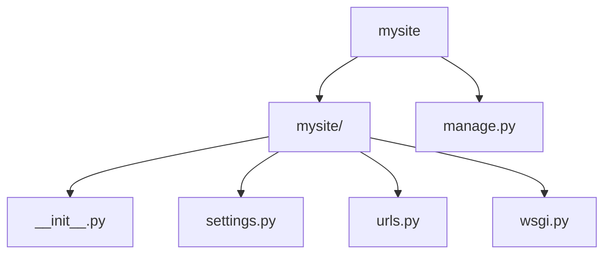
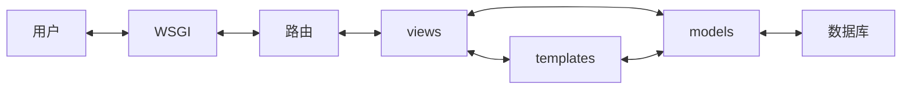

**django介绍**

### 基本操作

- django下载：运行`pip install django`即可。
- 基本的目录结构：

- 内层的`mysite/`是工程目录，保存代码、文件
- `__init__.py`是部署和配置整个工程的配置文件
- `urls.py`是路由的声明文件
- `wsgi.py`是web服务器的配置文件
- `manage.py`是一个与Django工程进行交互的工具

- **执行`python manage.py runserver`启动服务器。**
- `django-admin <command> [options]`可以对django工程进行一系列控制。
- `manage.py`只能对当前的工程文件进行控制。

### 创建一个具体应用

- `python manage.py startapp helloapp`创建新应用。
- 工程是一个总体的统一框架，而一个app实现具体的细分功能。

- 下一步：修改[`views.py`](mysite/helloapp/views.py)
- 下一步，修改[`urls.py`]( mysite/mysite/urls.py)

### django的MTV开发模式

