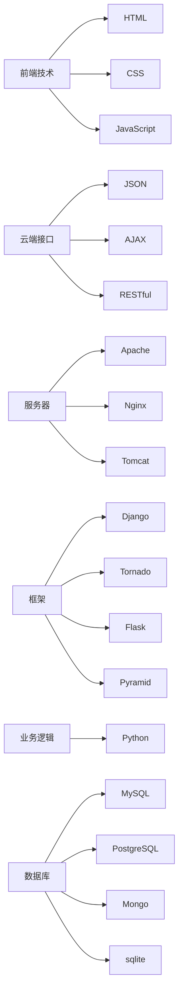

**Python体系的云端全栈开发：**

```mermaid
graph LR
前端技术 --> HTML & CSS & JavaScript
云端接口 --> JSON & AJAX & RESTful
服务器 --> Apache & Nginx & Tomcat
框架 --> Django &  Tornado & Flask & Pyramid
业务逻辑 --> Python
数据库 --> MySQL & PostgreSQL & Mongo & sqlite
```
